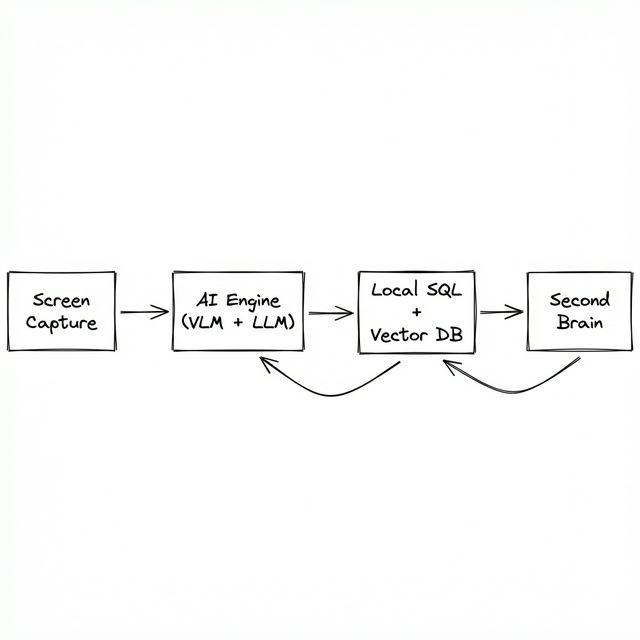
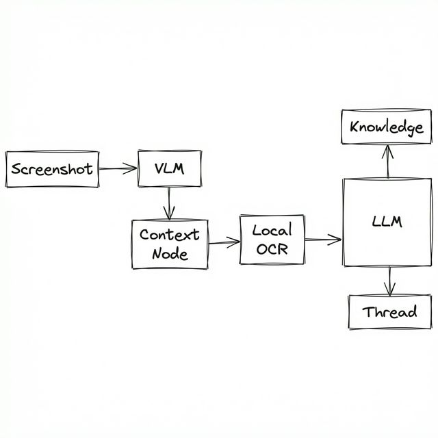

# Mnemora

<p align="center">
  
</p>

<p align="center">
  <strong>让你的屏幕成为第二大脑</strong><br>
  <strong>Let your screen become your second brain</strong>
</p>

<p align="center">
  <a href="https://github.com/mbaxszy7/Mnemora/actions/workflows/build.yml">
    
  </a>
  <a href="https://github.com/mbaxszy7/Mnemora/releases">
    
  </a>
  <a href="LICENSE">
    
  </a>
  
</p>

<p align="center">
  <a href="#中文">中文</a> | <a href="#english">English</a>
</p>

---

<h2 id="中文">📖 中文介绍</h2>

### 🎯 项目概述

Mnemora 是一款 **隐私优先的桌面“工作记忆”应用**：它持续捕获你的屏幕活动，并用 AI 将画面转成可检索的结构化上下文（知识、状态、行动项、线程），帮助你在“我刚刚在干什么/为什么这么做/接下来做什么”之间快速切换。

**核心理念：** "让你的屏幕成为第二大脑" —— 让计算机在本地构建你的上下文图谱，把碎片化的屏幕信息变成可追溯、可搜索、可回到现场的工作记忆。

**你可以用它做什么：**

- 回溯某个时间段的工作轨迹（按 20 分钟窗口聚合）
- 通过语义搜索找回“当时看到的页面 / 文档 / 对话内容”
- 用 **Thread Lens** 把跨应用、跨窗口的同一件事串起来，并用 Thread Brief 快速“恢复上下文”
- 当 AI 出错或队列堆积时，打开本地监控面板进行诊断（本机 Web Dashboard）

**适合谁：**

- 多任务切换频繁、需要“随时回到上下文”的开发者/研究者/写作者
- 想把屏幕上的信息沉淀为可检索知识的人（同时又希望数据尽可能保留在本地）

**为什么是 Mnemora：**

- **真正的本地优先**：数据落在 SQLite + 本地文件，默认不接入遥测；模型端点由你配置
- **可持续运行**：有背压与去重机制，避免“截图越跑越快、资源越堆越多”
- **混合理解链路**：VLM 批处理做结构化理解，必要时触发本地 OCR（中英文）补齐文本
- **可观测性内建**：本机 `127.0.0.1` 的监控面板 + SSE 流，能看到队列与 AI 请求/错误



### ✨ 项目特点

#### 1. 持续屏幕感知 🎥

- **智能屏幕捕获**：支持多显示器、窗口捕获；macOS 使用 `desktopCapturer` + `window_inspector` 的混合策略补全窗口元信息（跨 Space）
- **去重机制**：基于感知哈希（pHash）的图像去重，减少重复与噪声
- **背压控制**：按队列堆积动态调整捕获频率与去重阈值，避免系统资源过载

#### 2. 混合 AI 处理流水线 🧠

- **VLM 视觉理解**：批量分析屏幕内容，输出结构化上下文（标题/摘要/关键词/实体/知识/状态）
- **本地 OCR**：基于 Tesseract.js 的本地文本识别，支持中英文
- **智能决策**：由 VLM 决定是否需要 OCR 辅助，在精度与性能之间取得平衡

#### 3. 上下文图谱构建 🧭

- **语义搜索**：HNSW 向量索引 + SQLite FTS，让“找回当时看到的内容”更直接
- **Thread 线程追踪**：跨时间窗口追踪活动主题，把碎片化屏幕变成连贯的工作流
- **知识沉淀**：自动提取知识、状态快照、待办事项，减少重复整理

#### 🧵 Thread 线程（Thread Lens）

Mnemora 会将一段时间内“语义相关”的屏幕活动自动聚合成 **Thread（线程）**（例如“调试登录问题”、“写周报”、“阅读论文”）。在 Home 页的 **Thread Lens** 中，你可以：

- 查看当前最可能的活跃线程（Active Thread）以及其他候选线程
- 临时聚焦到某个候选线程（Preview/Temporary Focus，不会改变固定线程）
- **Pin 固定线程**：把某个线程作为持续上下文焦点（解析 active thread 时会优先使用）
- 生成/刷新 **Thread Brief**（线程简报，帮助快速回到上下文）
- 将某个线程标记为 **Inactive**（不再视为进行中）

#### 4. 隐私优先设计 🔒

- **本地优先**：SQLite 存储元数据/OCR 文本/上下文图谱；截图原图与向量索引存放在本地文件（默认会在处理后清理截图原图）
- **可配置 LLM**：支持本地模型或自定义 API 端点，数据不经过第三方
- **权限控制**：细粒度的系统权限管理，用户完全掌控数据

#### 5. 实时活动监控 🕒

- **活动时间线**：20 分钟窗口的活动聚合与可视化
- **长事件检测**：自动识别持续 25 分钟以上的深度工作时段
- **智能通知**：对关键状态变化进行提醒（如采集暂停、AI 熔断、活动摘要生成）

#### 6. 🔐 隐私宝库（Local-Only Vault）

Mnemora 强调“数据只属于你自己”：

- 📦 **全量本地存储**：截图、OCR 文本、向量索引、线程与上下文图谱都保存在本地（SQLite + 本地文件）。
- 🔧 **大模型由你自配**：VLM / LLM / Embedding 均由用户在设置页自行配置 `baseUrl` + `model` + `apiKey`（支持 OpenAI 兼容接口）。
- 🚫 **不内置第三方云服务/遥测**：项目默认不接入任何第三方统计/上报 API；只有在你配置了模型端点后，才会向该端点发起请求。

**默认本地数据路径（以代码实现为准）：**

- **截图文件（临时）**：`~/.mnemora/images/`
- **向量索引文件**：`~/.mnemora/vector_index.bin`
- **主进程日志**：`~/.mnemora/logs/main.log`
- **SQLite 数据库**：`app.getPath("userData")/mnemora.db`

> 说明：截图文件会以 `storage_state = "ephemeral"` 写入磁盘，VLM/OCR 完成后通常会删除并标记为 `"deleted"`；数据库保留元数据、OCR 文本与上下文节点。

#### 7. 📈 本地性能监控仪表盘（Web Dashboard）

应用内置一个本地性能监控与诊断面板（Web 页面），用于查看事件循环、CPU/内存、队列堆积、AI 请求与错误等指标：

- 🧪 **本地服务**：监控服务运行在本机 `127.0.0.1` 上，不对外暴露。
- ⚙️ **按需开启**：应用启动后，可在 **Settings** 中点击 _Monitoring Dashboard_ 打开。
- 🔗 **访问地址**：`http://127.0.0.1:<port>`（默认从 `23333` 起探测可用端口），通过 SSE `/api/stream` 实时推送指标。

### 🏗️ 架构设计

#### 系统分层架构

```
┌─────────────────────────────────────────────────────────────────┐
│                        渲染层 (Renderer)                        │
│  ┌──────────┐ ┌──────────┐ ┌──────────┐ ┌──────────┐          │
│  │   Home   │ │ Settings │ │  Search  │ │ Activity │          │
│  └──────────┘ └──────────┘ └──────────┘ └──────────┘          │
│  ┌──────────────────────────────────────────────────────────┐ │
│  │              React + React Router + Tailwind             │ │
│  └──────────────────────────────────────────────────────────┘ │
└─────────────────────────────────────────────────────────────────┘
                              │
                              │ IPC (Typed Channels)
                              ▼
┌─────────────────────────────────────────────────────────────────┐
│                        主进程 (Main)                            │
│  ┌──────────────────────────────────────────────────────────┐ │
│  │              Electron Main Process                        │ │
│  │         (Window Management, System Integration)           │ │
│  └──────────────────────────────────────────────────────────┘ │
│  ┌──────────────┐ ┌──────────────┐ ┌──────────────────────┐  │
│  │ Screen       │ │ Screenshot   │ │ AI Runtime           │  │
│  │ Capture      │ │ Processing   │ │ Service              │  │
│  │ Module       │ │ Pipeline     │ │ (VLM/Text/Embed)     │  │
│  └──────────────┘ └──────────────┘ └──────────────────────┘  │
│  ┌──────────────┐ ┌──────────────┐ ┌──────────────────────┐  │
│  │ Context      │ │ Thread       │ │ Vector Index         │  │
│  │ Graph        │ │ Service      │ │ (HNSW)               │  │
│  └──────────────┘ └──────────────┘ └──────────────────────┘  │
│  ┌──────────────┐ ┌──────────────┐ ┌──────────────────────┐  │
│  │ Activity     │ │ LLM Config   │ │ Monitoring           │  │
│  │ Monitor      │ │ Service      │ │ Dashboard            │  │
│  └──────────────┘ └──────────────┘ └──────────────────────┘  │
└─────────────────────────────────────────────────────────────────┘
                              │
                              ▼
┌─────────────────────────────────────────────────────────────────┐
│                        数据层 (Data)                            │
│  ┌──────────────────┐  ┌──────────────────┐                   │
│  │   SQLite         │  │   Vector Index   │                   │
│  │   (better-sqlite3)│  │   (HNSW)         │                   │
│  │                  │  │                  │                   │
│  │  - screenshots   │  │  - hnsw index    │                   │
│  │  - context_nodes │  │  - embeddings    │                   │
│  │  - threads       │  │                  │                   │
│  │  - batches       │  │                  │                   │
│  └──────────────────┘  └──────────────────┘                   │
│  ┌──────────────────┐                                          │
│  │   File Storage   │                                          │
│  │   ~/.mnemora/    │                                          │
│  └──────────────────┘                                          │
└─────────────────────────────────────────────────────────────────┘
```



#### 核心模块关系

```
ScreenCaptureModule
    │
    ├── CaptureService (desktopCapturer)
    │
    ├── CaptureScheduler (定时调度 + 背压控制)
    │
    ├── WindowFilter (窗口过滤 + 应用名称归一化)
    │
    └── ScreenshotProcessingModule
            │
            ├── BatchVlmScheduler (批量 VLM 分析)
            │
            ├── OcrScheduler (本地 OCR)
            │
            ├── ThreadScheduler (线程追踪)
            │
            ├── VectorDocumentScheduler (向量化)
            │
            └── ActivityTimelineScheduler (活动时间线)
```

### 🔧 关键实现

#### 1. 自适应背压控制（Capture Backpressure）

- **压力信号**：以待处理的 VLM batch 数量（`batches.vlm_status = "pending"`）作为 backlog 指标。
- **离散等级策略**：阈值与参数来自 `electron/services/screenshot-processing/config.ts` 的 `processingConfig.backpressure.levels`。
- **执行位置**：
  - `BackpressureMonitor` 定期检查 backlog，并在等级变化时发出 `backpressure:level-changed` 事件。
  - `ScreenCaptureModule` 接收事件后：
    - 调整 `ScreenCaptureScheduler` 的捕获间隔（`intervalMultiplier`）
    - 调整去重阈值（`phashThreshold`，用于 `SourceBufferRegistry`）

```typescript
// electron/services/screen-capture/screen-capture-module.ts
const newInterval = DEFAULT_SCHEDULER_CONFIG.interval * event.config.intervalMultiplier;
this.updateConfig({ interval: newInterval });
screenshotProcessingModule.setPhashThreshold(event.config.phashThreshold);
```

#### 2. 混合 OCR（VLM 触发，本地识别）

- **触发条件**：VLM 输出 `knowledge.language` 与 `knowledge.textRegion`，且语言属于 `processingConfig.ocr.supportedLanguages`（默认 `['en', 'zh']`）。
- **队列化**：`BatchVlmScheduler` 在写回 VLM 结果时将 `screenshots.ocrStatus` 设为 `"pending"`，并唤醒 `OcrScheduler`。
- **执行**：`OcrService.recognize({ filePath, textRegion })` 会按 ROI 裁剪并调用 Tesseract.js（默认 `eng+chi_sim`）。
- **清理策略**：OCR 成功后会写入 `screenshots.ocr_text`，并尝试删除原始截图文件（`storage_state` 置为 `"deleted"`）。

```typescript
// electron/services/screenshot-processing/schedulers/batch-vlm-scheduler.ts
const needsOcr =
  !!node.knowledge &&
  processingConfig.ocr.supportedLanguages.includes(node.knowledge.language) &&
  !!screenshot.filePath &&
  screenshot.storageState !== "deleted";

const ocrStatus = needsOcr ? "pending" : null;
```

#### 3. Thread 线程追踪（Thread Lens）

- **线程归属**：每个 `context_nodes` 可关联一个 `thread_id`；同一 Thread 可以跨应用/窗口与多个 20 分钟活动窗口。
- **LLM 分配**：`ThreadScheduler` 对缺少 `threadId` 的 batch 调用 `threadLlmService.assignForBatch(...)`，并由 `ThreadRepository` 落库。
- **幂等写入**：`threadId` 只会在 `NULL` 时写入（重试不会覆盖已有归属），因此**没有“自动合并/重写 threadId”**的逻辑。

```typescript
// electron/services/screenshot-processing/thread-repository.ts
.where(and(eq(contextNodes.id, node.id), isNull(contextNodes.threadId)))
```

- **长事件检测**：Activity Monitor 使用 `processingConfig.activitySummary.longEventThresholdMs`（默认 25 分钟）标记长事件。

#### 4. 语义搜索（SQLite FTS + HNSW + Deep Search）

- **向量索引**：HNSW（`hnswlib-node`）索引文件默认位于 `~/.mnemora/vector_index.bin`（见 `processingConfig.vectorStore.indexFilePath`）。
- **检索融合**：`ContextSearchService.search()` 会组合 keyword search（SQL `LIKE` + SQLite FTS `screenshots_fts`）与 semantic search（Embedding + HNSW ANN），并进行邻居扩展以补齐上下文。
- **Deep Search**：可选的 LLM query plan（`SearchQueryPlan`）与答案综合（`SearchAnswer`）会随 `SearchResult` 返回。

#### 5. 类型安全 IPC（shared 定义 + preload 暴露）

- **集中定义**：IPC 通道与通用结果包装在 `shared/ipc-types.ts`。
- **统一返回**：所有 handler 返回 `IPCResult<T>`（`success/data/error`）。
- **Renderer API**：`electron/preload.ts` 通过 `contextBridge` 暴露 `contextGraphApi`、`threadsApi`、`captureSourceApi` 等类型安全接口。

```typescript
// shared/ipc-types.ts
export const IPC_CHANNELS = {
  SCREEN_CAPTURE_START: "screen-capture:start",
  CONTEXT_SEARCH: "context:search",
  MONITORING_OPEN_DASHBOARD: "monitoring:open-dashboard",
  // ...
} as const;
```

#### 6. AI Runtime 并发控制 + 失败熔断（AIMD + Circuit Breaker）

- **按能力隔离**：VLM / Text / Embedding 分别限流（`aiRuntimeService.acquire('vlm' | 'text' | 'embedding')`）。
- **自适应并发**：AIMD 调参逻辑在 `electron/services/ai-runtime-service.ts`，用于在失败时快速降级、成功时逐步恢复。
- **熔断暂停采集**：连续失败会触发 fuse，并通过回调暂停/停止采集；恢复依赖配置校验与自动重试。

```typescript
// electron/services/screenshot-processing/vlm-processor.ts
const release = await aiRuntimeService.acquire("vlm");
try {
  // ...
  aiRuntimeService.recordSuccess("vlm");
} catch (error) {
  aiRuntimeService.recordFailure("vlm", error);
  throw error;
} finally {
  release();
}
```

### 🚀 快速开始

#### 环境要求

- **Node.js**: 22.x（见 `.nvmrc`）
- **pnpm**: 10.x
- **Python**: 3.9+（仅 macOS：用于构建 `window_inspector`）

#### 🧰 安装依赖

```bash
# 克隆仓库
git clone https://github.com/mbaxszy7/Mnemora.git
cd Mnemora

# 安装依赖
pnpm install

# 构建 window_inspector (macOS-only Python 工具；pnpm dev/build 也会自动触发)
pnpm run build:window_inspector
```

#### 🧑‍💻 开发模式

```bash
# 启动开发服务器（热重载）
pnpm dev

# 或：使用自定义 Electron.app（开发时替换图标/BundleId；从仓库根目录运行）
pnpm dev:custom-electron

# 如果原生模块加载异常（better-sqlite3 / hnswlib-node 等），可尝试
pnpm dev:rebuild
```

#### 📦 构建生产版本

```bash
# 完整构建（electron-builder；包含 native 模块重建）
pnpm build

# 或：使用 Electron Forge 打包（macOS 默认会同时产出 `.zip` 与 `.dmg`）
pnpm forge:make
```

#### 🗄️ 数据库迁移

```bash
# 生成迁移文件
pnpm db:generate

# 应用迁移（应用启动时自动执行）
pnpm db:push

# 可视化数据库管理
pnpm db:studio
```

### 🛠️ 技术栈

| 层级         | 技术                             |
| ------------ | -------------------------------- |
| **桌面框架** | Electron + Vite                  |
| **前端 UI**  | React + Tailwind CSS + shadcn/ui |
| **状态管理** | React Query + Zustand            |
| **数据库**   | SQLite + Drizzle ORM             |
| **向量索引** | HNSW (hnswlib-node)              |
| **AI SDK**   | Vercel AI SDK                    |
| **OCR**      | Tesseract.js                     |
| **图像处理** | sharp                            |
| **国际化**   | i18next                          |
| **日志**     | pino                             |
| **测试**     | Vitest                           |

### 📄 许可证

[MIT License](LICENSE)

---

<h2 id="english">📖 English</h2>

### 🎯 Project Overview

Mnemora is a **privacy-first desktop “work memory” app**. It continuously captures your screen activity and turns what you see into searchable, structured context (knowledge, state snapshots, action items, and Threads) so you can quickly answer:

- What was I working on?
- Why did I do it this way?
- What should I do next?

**Core Philosophy:** "Let your screen become your second brain" — build a local context graph from your screen, so your work becomes traceable, searchable, and easy to resume.

**What you can do with it:**

- Review your recent work history in 20-minute activity windows
- Retrieve “the page / document / screen I saw earlier” via semantic search
- Use **Thread Lens** + Thread Brief to quickly regain context across apps and windows
- Open the local monitoring dashboard to diagnose backlogs and AI failures

**Who it's for:**

- People who context-switch a lot (developers, researchers, writers)
- Anyone who wants searchable knowledge from their screen while keeping data local-first

**Why Mnemora:**

- **Local-first by default**: data lives in SQLite + local files; no built-in third-party telemetry; you bring your own model endpoints
- **Built to run continuously**: dedup + backpressure control to avoid uncontrolled growth
- **Hybrid understanding**: batch VLM for structured understanding, plus local OCR (EN/ZH) when needed
- **Observability included**: local-only web dashboard on `127.0.0.1` with SSE streaming


### ✨ Features

#### 1. Continuous Screen Awareness

- **Intelligent Screen Capture** 🎥: Multi-monitor + window capture; on macOS uses a hybrid window-source strategy (`desktopCapturer` + `window_inspector`) to improve window metadata across Spaces
- **Deduplication** 🧹: Perceptual hash (pHash) based deduplication to reduce noisy, near-duplicate screenshots
- **Backpressure Control** 🧯: Adjusts capture frequency (and dedup sensitivity) based on backlog to prevent overload

#### 2. Hybrid AI Processing Pipeline

- **VLM Visual Understanding** 🧠: Batch multimodal analysis that extracts structured context from screenshots
- **Local OCR** 🔤: Tesseract.js based local text recognition (Chinese + English)
- **Smart Decision** ⚖️: VLM decides whether OCR is needed, balancing accuracy and performance

#### 3. Context Graph Construction

- **Semantic Search** 🧭: HNSW vector index + SQLite FTS for fast retrieval
- **Thread Tracking** 🧵: Cross-time-window activity tracking that forms coherent workflows
- **Knowledge Accumulation** 📚: Automatic extraction of knowledge, state snapshots, and action items

#### 🧵 Thread (Thread Lens)

Mnemora groups semantically related screen activity into **Threads** (e.g., “debugging login issues”, “writing a report”, “reading a paper”). In the Home page **Thread Lens**, you can:

- See the most likely active thread plus other candidates
- Temporarily focus on a candidate (Preview/Temporary Focus, without changing your pinned thread)
- **Pin a thread** as your persistent context focus
- Generate/refresh a **Thread Brief** to quickly regain context
- Mark a thread as **Inactive** when it’s no longer in progress

#### 4. Privacy-First Design

- **Local-First** 🔒: SQLite stores metadata/OCR/context graph; raw captures and vector index are stored as local files (capture files may be cleaned up after processing)
- **Configurable LLM** 🔧: Support for local models or custom API endpoints, data doesn't go through third parties
- **Permission Control** 🛡️: Fine-grained system permission management, user fully controls data

#### 5. Real-Time Activity Monitoring

- **Activity Timeline** 🕒: 20-minute window activity aggregation and visualization
- **Long Event Detection** ⏳: Automatic identification of deep work sessions lasting 25+ minutes
- **Smart Notifications** 🔔: Desktop notifications for key state changes (capture paused, AI failure fuse tripped, activity summary ready)

#### 6. 🔐 Privacy Vault (Local-Only)

Mnemora is designed with “your data stays yours” in mind:

- 📦 **Everything is stored locally**: screenshots, OCR text, vector index, threads, and context graph live on your machine.
- 🔧 **Bring your own models**: VLM / LLM / Embeddings are configured by you in Settings via `baseUrl` + `model` + `apiKey` (OpenAI-compatible endpoints).
- 🚫 **No built-in third-party telemetry**: the project does not ship with analytics / reporting integrations; outbound requests only happen when you configure model endpoints.

**Default local data locations (source of truth in code):**

- **Screenshot files (ephemeral)**: `~/.mnemora/images/`
- **Vector index file**: `~/.mnemora/vector_index.bin`
- **Main process logs**: `~/.mnemora/logs/main.log`
- **SQLite database**: `app.getPath("userData")/mnemora.db`

> Note: capture files are written with `storage_state = "ephemeral"` and are typically deleted after VLM/OCR completes (`"deleted"`); the database keeps metadata, OCR text, and context nodes.

#### 7. 📈 Local Performance Monitoring Dashboard (Web)

The app ships with a local web-based monitoring & diagnostics dashboard for event loop, CPU/memory, queue backlogs, and AI request/error traces:

- 🧪 **Local-only server**: runs on `127.0.0.1` and is not exposed publicly.
- ⚙️ **On-demand**: after the app starts, open **Settings** → _Monitoring Dashboard_.
- 🔗 **URL**: `http://127.0.0.1:<port>` (tries available ports starting from `23333`), with real-time streaming over SSE `/api/stream`.

### 🏗️ Architecture

#### System Layer Architecture

```
┌─────────────────────────────────────────────────────────────────┐
│                      Renderer Layer                             │
│  ┌──────────┐ ┌──────────┐ ┌──────────┐ ┌──────────┐          │
│  │   Home   │ │ Settings │ │  Search  │ │ Activity │          │
│  └──────────┘ └──────────┘ └──────────┘ └──────────┘          │
│  ┌──────────────────────────────────────────────────────────┐ │
│  │              React + React Router + Tailwind             │ │
│  └──────────────────────────────────────────────────────────┘ │
└─────────────────────────────────────────────────────────────────┘
                              │
                              │ IPC (Typed Channels)
                              ▼
┌─────────────────────────────────────────────────────────────────┐
│                      Main Process                               │
│  ┌──────────────────────────────────────────────────────────┐ │
│  │              Electron Main Process                        │ │
│  │         (Window Management, System Integration)           │ │
│  └──────────────────────────────────────────────────────────┘ │
│  ┌──────────────┐ ┌──────────────┐ ┌──────────────────────┐  │
│  │ Screen       │ │ Screenshot   │ │ AI Runtime           │  │
│  │ Capture      │ │ Processing   │ │ Service              │  │
│  │ Module       │ │ Pipeline     │ │ (VLM/Text/Embed)     │  │
│  └──────────────┘ └──────────────┘ └──────────────────────┘  │
│  ┌──────────────┐ ┌──────────────┐ ┌──────────────────────┐  │
│  │ Context      │ │ Thread       │ │ Vector Index         │  │
│  │ Graph        │ │ Service      │ │ (HNSW)               │  │
│  └──────────────┘ └──────────────┘ └──────────────────────┘  │
│  ┌──────────────┐ ┌──────────────┐ ┌──────────────────────┐  │
│  │ Activity     │ │ LLM Config   │ │ Monitoring           │  │
│  │ Monitor      │ │ Service      │ │ Dashboard            │  │
│  └──────────────┘ └──────────────┘ └──────────────────────┘  │
└─────────────────────────────────────────────────────────────────┘
                              │
                              ▼
┌─────────────────────────────────────────────────────────────────┐
│                        Data Layer                               │
│  ┌──────────────────┐  ┌──────────────────┐                   │
│  │   SQLite         │  │   Vector Index   │                   │
│  │   (better-sqlite3)│  │   (HNSW)         │                   │
│  │                  │  │                  │                   │
│  │  - screenshots   │  │  - hnsw index    │                   │
│  │  - context_nodes │  │  - embeddings    │                   │
│  │  - threads       │  │                  │                   │
│  │  - batches       │  │                  │                   │
│  └──────────────────┘  └──────────────────┘                   │
│  ┌──────────────────┐                                          │
│  │   File Storage   │                                          │
│  │   ~/.mnemora/    │                                          │
└─────────────────────────────────────────────────────────────────┘
```


### 🔧 Key Implementations

#### 1. Adaptive Capture Backpressure

Dynamic adjustment based on pending VLM batch count (`batches.vlm_status = "pending"`):

- Capture interval scaling via `intervalMultiplier`
- pHash dedup sensitivity via `phashThreshold`
- Recovery hysteresis to avoid oscillation

#### 2. Hybrid OCR (VLM-triggered, local execution)

VLM outputs `knowledge.language` + optional ROI (`textRegion`). Only supported languages (`en`, `zh`) trigger local Tesseract.js OCR. OCR results are stored in SQLite; capture files may be cleaned up after processing.

#### 3. Thread Tracking (Thread Lens)

Thread assignment is done batch-wise by the Thread LLM for nodes missing `threadId`. Assignments are **write-once** (`threadId` is only set when NULL), so there is **no automatic thread merging/overwriting**. Long-event detection uses a 25-minute threshold.

#### 4. Semantic Search (SQLite FTS + HNSW + Deep Search)

Combines keyword search (LIKE + SQLite FTS) and vector search (HNSW index stored at `~/.mnemora/vector_index.bin`), with optional LLM query planning (`SearchQueryPlan`) and answer synthesis (`SearchAnswer`).

#### 5. Type-Safe IPC (shared channels + preload APIs)

Centralized `IPC_CHANNELS` + `IPCResult<T>` in `shared/ipc-types.ts`, handlers registered through `IPCHandlerRegistry`, and typed APIs exposed in `electron/preload.ts` (e.g. `contextGraphApi`, `threadsApi`, `captureSourceApi`).

#### 6. AI Runtime Concurrency + Failure Fuse

Per-capability semaphores (`vlm` / `text` / `embedding`) with adaptive concurrency tuning (AIMD) and a circuit breaker that can pause/stop capture on repeated AI failures and auto-resume after config validation.

### 🚀 Quick Start

```bash
# Clone repository
git clone https://github.com/mbaxszy7/Mnemora.git
cd Mnemora

# Install dependencies
pnpm install

# Build window_inspector (macOS-only Python tool; pnpm dev/build also triggers it)
pnpm run build:window_inspector

# Development mode
pnpm dev

# If native modules fail to load (better-sqlite3 / hnswlib-node), try
pnpm dev:rebuild

# Production build
pnpm build

# Or: package with Electron Forge (zip + dmg on macOS)
pnpm forge:make
```

### 📄 License

[MIT License](LICENSE)

---

<p align="center">
  Made with ❤️ by <a href="https://github.com/mbaxszy7">Frank Yan</a>
</p>
