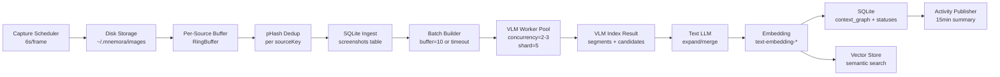
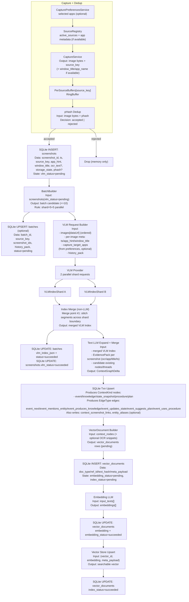

# Screenshot Processing & Context Graph v2（面向实现的可落地方案）

> 本文档在 `screenshot-process-adaptive.md` 的基础上**重做**：以当前代码现状为基线（Electron 主进程截图落盘、VLM 单图 IPC、SQLite 仅存 LLM config），补齐“10 张截图批处理 + 一图多上下文提取”的工程化细节，并重新设计 Context 分类与合并方式，确保 **数据层可追溯用户操作的连贯性**、减少信息孤岛。

---

## 1. 目标与约束

### 1.1 目标

- 将截图从“文件落盘”升级为“可检索、可追溯、可合并、可总结”的**事件流**。
- 支持 **按源（screen/window）缓存截图，凑满 10 张（或超时）调用 VLM**。
- 支持 **一批截图产生多种 Context（事件/知识/状态/流程/计划/实体）**，同时避免输出膨胀导致失败。
- 引入“连续性一等公民”：
  - 数据层面可以看见用户操作的连续轨迹（thread/segment/edge）
  - 合并策略不会把信息“吃掉”或变成不可追溯的黑箱
- 落地到 **SQLite（权威存储） + Vector Store（语义检索）**。

### 1.2 非目标（本轮不强行实现）

- 不在本轮强制引入云端服务；默认本地运行。
- 不强制绑定某个向量库（优先给出可落地的默认方案 + 可替换接口）。

### 1.3 当前代码约束（现状对齐）

- 截图：`ScreenCaptureModule` 按 6s/帧采集并保存到 `~/.mnemora/images`（是否长期保留取决于 retention 策略；如果识别后清理，则不能依赖长期可用的 `file_path` 进行回看）。
- VLM：主进程仅提供 `vlm:analyze`（单图 base64）IPC；Schema 目前是简单 `title/description/objects/text/confidence`。
- SQLite：Drizzle schema 目前只暴露 `llm_config`；截图/上下文图/队列等表需要在本方案中补齐。
- 当前仓库未发现可用的独立 Vector DB 实现（仅在文档中提到）。

---

## 2. 核心问题 Review 结论（先给结论，细节见后文设计）

### 2.1 问题 1：10 张批处理 + 一图多上下文提取，返回变大是否有失败风险？如何处理？

**结论**：有风险，但可控。风险点不只来自“返回大”，更常见的失败来自：

- **输入侧限制**：一次请求携带 10 张图像，总字节/视觉 token 可能触发 provider 限制或超时。
- **输出侧截断**：输出 token 上限触发截断，导致 JSON 不完整→解析失败。
- **JSON 结构复杂导致模型更易跑偏**：items 数太多 + summary 太长 + entities 太复杂，会显著增加无效 JSON 概率。

**推荐处理策略（工程化）**：

- **[两阶段输出]** VLM 只做“索引级结果（Index）”，控制输出小且稳定；细节扩写/合并交给 Text LLM：
  - Phase A（VLM Index）：输出 `segments` + `signals` + “每类最多 K 条”的候选 items（短 summary）。
  - Phase B（Text LLM Expand/Merge）：对重要 segments 做扩写和合并，生成可存储的 Context Nodes。
- **[强约束 Schema + 硬上限]**：
  - 每批最多 `maxItemsPerBatch`（建议 20）
  - 每个字段最大长度（title/summary/keywords/entities）
  - `keywords<=5`、`entities<=5`
- **[自适应降载]**：当检测到输入过大或内容过密：
  - 降分辨率 / 降 JPEG quality
  - 拆分 batch（10→5+5）或按 sourceKey 分拆
  - 只提取 importance≥阈值的 items（低重要度延后或丢弃）
- **[可靠性兜底]**：
  - 解析失败：先重试一次“更短输出”提示；仍失败则将 raw text 入库并标记 `needs_repair`，走 JSON repair pipeline。
  - provider 超时/429：指数退避 + jitter；保留幂等键避免重复写。

### 2.2 问题 2：当前 ContextType 分类不合理，如何从信息分类与整合角度改进？

**结论**：目前 `activity/semantic/state/procedural/intent` 的主要问题是：

- **维度混合**：
  - `activity` 是时间序列事件；`semantic` 是可长期复用知识；`state` 是某对象的快照；`procedural` 是可复用流程；`intent` 是未来计划。
  - 它们不是互斥的“抽屉”，同一截图/同一段行为往往同时包含多个维度。
- **容易产生信息孤岛**：仅按 type 分桶 + 分别合并，会丢失跨类型联系（例如：同一段 activity 触发的知识点/状态变化/下一步计划无法在数据层串起来）。

**推荐改法（强烈建议）**：把“连续性”从 type 中拆出来，建立**Context Graph**：

- 一切从 **Event（发生了什么）** 开始：每批/每段都先生成 Event 节点（不可省略）。
- 其他类型不再作为“平级主分类”，而是作为 Event 的 **派生节点（Derived Nodes）**：
  - `knowledge`（原 semantic）
  - `state_snapshot`（原 state）
  - `procedure`（原 procedural）
  - `plan/todo`（原 intent）
  - `entity_profile`（实体维表）
- 用 **Thread/Segment + Edges** 表达连续性：
  - `thread_id`：同一条连续活动轨迹
  - `segment_id`：批内/窗口内的连续片段
  - `edges`：event→knowledge、event→state、event→plan、event↔event（next/prev）等

这样 type 不再承担“连续性 + 内容分类”两种职责，合并策略也更稳定。

---

## 3. 总体架构（推荐）

### 3.1 Pipeline 视图



#### 3.1.1 端到端数据流（每环节 I/O + 合并点 + 入库点）



### 3.2 关键设计原则

- **SQLite 作为真相源（Source of Truth）**：任何中间态（待处理/失败/重试）都要可恢复。
- **VLM 不做长文本“终稿”**：VLM 输出要短、结构化、可验证。
- **连续性数据化**：Thread/Segment/Edge 明确可查。
- **幂等与可恢复**：使用“状态机字段 + 启动扫描恢复”的方式保证可重放（不依赖 `jobs` 表）。

### 3.3 SourceRegistry / Per-Source Buffer 的维护机制（保证 pHash 去重与源变动下的数据准确性）

目标：

- 在多屏 + 多 app/window 截图的情况下，保证 **pHash 仅在同源内比较**（避免 window 截图与 screen 截图互相“误杀”）。
- 在 source 动态变化（外接显示器插拔、用户频繁改 capture preferences、窗口出现/消失）时，保证 `Map<source_key, RingBuffer>` 不积累脏数据、不漏源。

建议实现：

- `source_key` 规范：
  - 屏幕：`screen:<displayId>`
  - 窗口：`window:<desktopCapturerSourceId>`（运行期稳定即可；跨重启不要求稳定，因为 buffer 本身不持久化）
- `SourceRegistry`：
  - 输入：`CapturePreferencesService`（用户配置） + `CaptureSourceProvider`（当前可用源）
  - 输出：`active_sources: Set<source_key>`（本轮允许 capture 的源集合）
  - 刷新触发：
    - 定时刷新：复用 `AutoRefreshCache`
    - 事件刷新：preferences 变更时立即触发一次 refresh

- `PerSourceBuffers`：`Map<source_key, { buffer, last_seen_at, source_generation }>`
  - refresh 时：
    - 对 `active_sources` 中的每个 `source_key`：若不存在则创建 buffer；更新 `last_seen_at=now`；并递增/更新 `source_generation`
    - 对于不再属于 `active_sources` 的 key：不立即删除，进入 `grace_period`（例如 30-90s），超时后删除 buffer 并丢弃未成 batch 的截图引用
  - capture 时：只有当 `source_key ∈ active_sources` 才允许写入该 buffer（防止 refresh 间隙写入已下线源）

- pHash 去重的准确性保证：
  - 仅对同一个 `source_key` 的 buffer 内做比较（按你当前考虑的 map 分桶）
  - buffer 删除/重建时，会自然重置该源的去重上下文（这符合“源已变化”的语义：例如外接显示器切换）
  - 窗口源建议额外记录 `app_hint/pid`（若可获取），用于后续 thread 合并与检索，而不是用于跨源去重

#### 3.3.1 pHash 计算实现建议（不使用 imghash）

- 不引入 `imghash`，直接使用现有依赖 `sharp` 进行图像预处理，并在项目内实现 pHash（DCT）
- 推荐算法：
  - 预处理：解码 → 灰度 → resize 到 `32x32` → `raw` 灰度像素
  - 2D DCT：对 `32x32` 做 DCT
  - 取低频：取左上 `8x8`（通常跳过 DC 分量用于阈值计算）
  - hash：与中位数比较生成 `64-bit`（建议存 `16-char hex`）

#### 3.3.2 是否会 block 主线程？

- `sharp(...).toBuffer()` 是异步调用，底层由 native 线程池执行，通常不会在 JS 主线程上做大块同步工作。
- 自实现 DCT 属于 JS 计算，理论上会占用调用线程；但输入固定为 `32x32`，单次计算量很小。
- 需要隔离/降载的典型情况：捕获频率更高、同时活跃源更多、或主进程还承担大量 DB/IPC/编排工作。

#### 3.3.3 高性能封装（推荐）

- **有界窗口**：每个 `source_key` 仅保留最近 `windowSize=32` 个 hash（RingBuffer），判重只遍历窗口，避免 `Set` 变成无界内存。
- **并发限制**：对 pHash 计算增加 `concurrency=2-4` 的限流，避免短时间堆积过多 sharp 任务导致线程池拥塞。
- **可选 Worker Pool**：若主进程压力较大，可将“DCT + hash 生成”放到 `worker_threads` 池；主线程仅负责 sharp 预处理调度与判重逻辑。

---

## 4. VLM 批处理识别的具体实现设计

### 4.1 数据单元定义

#### 4.1.0 截图保留策略（Retention）

- 图片仅用于当前 batch 的 VLM 识别；完成后可被清理。
- 关键要求：必须把“可检索证据”落到 SQLite（例如 `ocr_text`、`app_hint/window_title`、VLM Index、LLM Expand 后的 event/knowledge）。否则一旦图片清理，后续无法回答跨天问题。
- 推荐：保留 **最小 EvidencePack**（见 4.6），以便不依赖原图也能复盘。
- 本方案中 `screenshots` 表存的是“去重后被接受（accepted）的截图帧”，也就是后续可能进入 VLM/LLM 的那一批证据帧。
- 入库时机：**pHash 去重通过后立即入库（VLM 之前）**，并用状态字段标记后续处理进度；这样即使 app 重启，也能通过扫描 `pending/failed` 继续处理。
- 被 pHash 判定为重复（rejected）的帧不进入 `screenshots` 表；它们只存在于内存 buffer 的短期生命周期中。

#### 4.1.1 Screenshot（输入）

- `screenshot_id`：SQLite 自增或 UUID
- `source_key`：`screen:<displayId>` 或 `window:<desktopCapturerSourceId>`
- `ts`：capture timestamp
- `file_path`：落盘路径（**可选**；仅在长期保留模式下可作为长期证据索引）
- `storage_state`：`ephemeral|persisted|deleted`
- `retention_expires_at`：可选（用于短期缓存模式的清理调度）
- `phash`：可选（用于观测/调试；以及在 app 重启后用“最近已入库帧的 pHash”做去重窗口预热，减少重复帧再次进入 VLM；在线去重仍以 `PerSourceBuffers` 的内存比较为准）
- `width/height/bytes/mime`：预检用
- `app_hint`：可选（如 `Teams|VSCode|Chrome`；来源可为窗口元信息（如果有SourceRegistry app 的应用数据）或 OCR/VLM 识别）
- `window_title`：可选（若可获取）
- `ocr_text`：可选但强烈推荐（短期缓存模式下，跨天检索几乎必须依赖它或等价文本证据）

#### 4.1.2 Batch（VLM 请求单元）

- `batch_id`：UUID
- `source_key`：单源为主（避免跨源视觉上下文互相干扰）
- `screenshot_ids[]`：最多 10
- `ts_start/ts_end`
- `history_pack`：从 SQLite 的 context graph 里抽取少量摘要（见 4.3）
- `screenshots_meta[]`：与 `screenshot_ids` 对齐的元信息（建议至少包含 `ts/app_hint/window_title`），用于在请求 VLM/Text LLM 时附带输入（尤其对“按 app 截图”的场景更有帮助）
- `capture_target_apps[]`：可选；当用户在 `CapturePreferencesService` 中配置了“按 app 截图”或选择了 app 列表时，把该列表作为额外提示传入 VLM/Text LLM（如果为空则不传）
- `shards`：默认把 `screenshot_ids` 按顺序拆成两段（`[0..4]` + `[5..9]`），并行请求 VLM；每个 shard 独立返回 Index，主进程对两个 Index 做合并与去重后再进入 Text LLM 阶段

并行 shard 的约束：

- 两个 shard 必须使用同一份 `history_pack`（以及同版本 prompt），避免“前 5 张认为是新 thread、后 5 张认为是旧 thread”的分叉
- shard 拆分必须保持时间顺序（按 `screenshot_ids` 的 capture time 排序后再切片）

### 4.3 历史上下文传递（连续性的关键，但必须控 token）

**目标**：让 VLM 知道“这批图可能是上一段活动的继续”，但不能把历史全文塞进去。

#### 4.3.1 HistoryPack 组成（建议）

- `recent_threads`：最近 1-3 条 thread 的 `thread_title + last_event_summary(<=200 chars)`
- `open_segments`：窗口内（如 15min）仍未闭合的 segment 摘要
- `recent_entities`：最近提到的 5-10 个实体 canonical name

> 重要：HistoryPack 的存在是为了 **merge decision**，不是为了把历史内容复制到新输出中。

### 4.4 VLM 输出：改为“索引级（Index）结果”

#### 4.4.1 为什么不让 VLM 直接输出最终多上下文长文本？

- 一次 10 图 + 多类型 + 详细 summary 很容易触发输出截断，导致 JSON 不完整。
- VLM 更擅长“识别 + 结构化标注”，不擅长长篇稳定 JSON。

#### 4.4.2 推荐 VLM Response Schema（示例）

- **segments**：把截图按“同一活动”分段（连续性基础）
- **candidates**：每段最多 K 个候选节点（短摘要）

如果使用 `5+5` 并行 shard，则每个 shard 输出一份 Index：

- 合并策略（主进程执行）：
  - 按 `screen_ids` 的时间顺序拼接两个 shard 的 `segments`
  - 对 shard 边界处的 segment 做一次“连续性拼接”（例如相邻且 `event.title`/实体高度相似则合并）
  - 合并后仍需满足 `segments.length <= 4` 的硬约束（宁可更粗，不要过碎）

```json
{
  "segments": [
    {
      "segment_id": "s1",
      "screen_ids": [1, 2, 3, 4],
      "event": {
        "title": "...",
        "summary": "<=200 chars",
        "confidence": 0,
        "importance": 0
      },
      "derived": {
        "knowledge": [{ "title": "...", "summary": "<=180" }],
        "state": [{ "object": "...", "summary": "<=180" }],
        "procedure": [{ "title": "...", "steps": ["<=80", "<=80"] }],
        "plan": [{ "title": "...", "summary": "<=140" }]
      },
      "merge_hint": {
        "decision": "NEW|MERGE",
        "thread_id": "optional"
      }
    }
  ],
  "entities": ["<=20 canonical names"],
  "notes": "optional short"
}
```

**强约束**（必须写进 prompt）：

- `segments.length <= 4`（一批 10 张，最多识别 4 段活动，否则过碎）
- 每段 `knowledge/state/procedure/plan` 各自 `<=2`
- summary 严格限长

#### 4.4.3 VLM Request 输入（建议携带截图时间 + app 元信息）

为提升分段连续性、减少 UI 语境误判、并在“按 app 截图”的产品形态下提高稳定性，建议在调用 VLM 时把每张图对应的元信息一起传入（作为 prompt 的文本部分，不需要改图片本体）：

- 每张截图（按 `screen_ids` 顺序）：
  - `screenshot_id`
  - `captured_at`（ISO time 或 ms timestamp）
  - `source_key`
  - `app_hint`（如果能从 SourceRegistry/窗口元信息拿到）
  - `window_title`（若可获取）
- 批级别（可选）：
  - `capture_target_apps[]`：来自 `CapturePreferencesService` 的 selected apps（当用户配置了按 app 截图时）；用于提示模型“这批截图预期来自哪些 app”，但不作为强约束

注意：

- 对于 `screen:<displayId>` 这类全屏截图，`app_hint/window_title` 可能为空；此时传 `null` 即可，避免编造。
- `captured_at` 不要求 VLM 输出 event_time，但会显著提升“相邻截图是否同一段活动”的判断质量；event_time 可在 Text LLM 阶段结合 `ts_start/ts_end` 统一生成。

### 4.5 Text LLM 阶段：Expand + Merge（生成可落库 ContextGraph）

VLM Index 出来后，交给 Text LLM 完成：

- 把 `segment.event` 扩写为可存储的 EventNode（允许更长，但仍需限长）
- 把 derived 节点标准化（补 keywords/entities/refs）
- 执行合并（merge）与 thread 续接
- 生成可落库的 ContextGraph 变更集：`context_nodes`（见 5.1.1）与 `context_edges`（见 5.1.2），并写入 `context_screenshot_links`（截图证据关联）

> 这一步可以复用 `prompts_en.yaml` 中 merging 逻辑，但要注意：合并对象应是“同 kind”的节点，并且需要 thread 约束。

### 4.6 按 screenshot_id “按需回看”（Evidence Rehydrate）

这里的“按需回看”指的是：当合并/回答问题需要更多证据时，系统可以根据 `screenshot_id` 补齐输入，但不要求默认链路重复喂整批图片。

**EvidencePack（建议最小集合）**：当图片可能被清理时，建议在 `screenshots` 表（或独立表）保存最小证据包，作为跨天检索与问答的依据：

- `app_hint`、`window_title`（若可获取）
- `ocr_text`（建议限长，例如 `<= 8k chars`；过长则存“文本片段 + 哈希 + 分段”）
- `ui_text_snippets[]`（可选：从 OCR 中抽取 5-20 条高价值片段，例如消息气泡/结论句）
- `detected_entities[]`（可选：人名/项目名/issue id 的候选，带置信度与来源）
- `vlm_index_fragment`（可选：VLM Index 中与该 screenshot 强相关的短片段，便于回溯）

- **默认（推荐）：Text LLM 回看**
  - 编排层（非模型）根据 `screenshot_id` 从 SQLite 读取 EvidencePack（例如 `ocr_text`、`app_hint/window_title`、已落库的 VLM Index/LLM 片段），再把文本证据拼进 Text LLM 的输入。
  - 这不需要 provider 的 function-calling；只需要在调用 LLM 前做一次 DB 查询与拼装。

- **可选兜底：VLM 回看**
  - 仅当 `storage_state=persisted` 且能拿到图片（`file_path` 或缓存 key）时，才允许对少量关键 `screenshot_id` 重新调用 VLM 做视觉校验/补提取。
  - 若图片已清理（`deleted`），则无法 VLM 回看，只能依赖 `ocr_text` 与已存的结构化结果。

---

## 5. Context 分类与合并设计（减少信息孤岛）

### 5.1 新的分类：从“类型枚举”升级为“图模型”

#### 5.1.1 节点类型（ContextKind）

- `event`：用户在做什么（时间序列，一定存在）
- `knowledge`：可长期复用的知识点（原 semantic）
- `state_snapshot`：某对象在某时刻的状态（原 state）
- `procedure`：可复用步骤（原 procedural）
- `plan`：未来计划/待办（原 intent）
- `entity_profile`：实体资料（建议作为维表，不从截图直接“终稿化”，而是逐步完善）

#### 5.1.2 关系边（EdgeType）

- `event_next`：Event 的时间顺序
- `event_mentions_entity`
- `event_produces_knowledge`
- `event_updates_state`
- `event_suggests_plan`
- `event_uses_procedure`

> 注意：截图证据通过 `context_screenshot_links` 表关联，不使用边类型。这种设计更自然，避免将截图建模为节点。

### 5.2 合并策略（按 kind，不按旧 type 混合）

- **event 合并（最严格）**：
  - 必须同 thread + 同一明确任务目标 + 时间连续
  - 合并后保留 `merged_from_ids`，并保持 screenshot links

- **knowledge 合并（按主题）**：
  - 同 topic（实体+关键词）可合并
  - 允许跨 event/thread 合并，但必须保留引用边（否则变知识孤岛）

- **state_snapshot 合并（按 object）**：
  - 同 object 的状态更新可合并为“状态时间线”或保留为多快照

- **procedure 合并（按目标与步骤相似）**：
  - 更适合“增量补全步骤”，而不是频繁合并覆盖

- **plan 合并（按同一目标）**：
  - 计划更应该落到 SQLite 的 todo/task 表；plan node 只是“提取候选”

### 5.3 避免信息孤岛的硬性规则

- 所有 `knowledge/state/procedure/plan` 节点必须至少存在一条边指回某个 `event`（来源可追溯）。
- 对外“语义检索”返回的节点，必须能追溯到：
  - 相关 event
  - 相关 screenshot 证据

---

## 6. 队列设计、错误处理与重试

### 6.1 为什么需要“可持久化队列”

截图是连续流；VLM/LLM 是外部依赖，必须容忍：

- app 重启
- provider 限流/超时
- JSON 解析失败

因此队列必须落 SQLite。

本方案不使用 `jobs` 表，而是用“**状态机字段 + 启动扫描恢复**”实现最小可恢复（resumable）：

- 各阶段的执行状态写在权威表中（例如 `screenshots/context_nodes/vector_documents`）
- 主进程维护一个轻量的 `reconcile loop`：周期性扫描 `pending/failed` 的记录并执行；成功/失败都写回状态

如果 app 退出/崩溃，下次启动时可以接着执行：

- 启动时扫描：
  - 将 `running` 且超时未更新（例如 2-5min）的记录回滚为 `pending`
  - 继续处理 `pending` 与可重试的 `failed`
- 配合唯一约束与幂等写入（例如 `vector_documents.text_hash`、`batches.idempotency_key`），避免重复执行导致的数据重复

### 6.2 状态机字段（推荐最小集合）

建议把状态字段直接落在“权威数据表”上，让队列可以从 SQL 重建：

- `screenshots`（只存去重后 accepted 的帧）：
  - `vlm_status = pending|running|succeeded|failed`
  - `vlm_attempts`、`vlm_next_run_at`
  - `vlm_error_code`、`vlm_error_message`
- `batches`（可选，但强烈建议，尤其在 `5+5` shard 并行时）：
  - `idempotency_key`（例如 `vlm_batch:<source_key>:<ts_start>-<ts_end>:<hash(screenshot_ids)>`）
  - `shard_status_json`（记录两个 shard 的状态/attempts/error）
  - `index_json`（合并后的 VLM Index）
- `context_nodes`：
  - `merge_status`（Text LLM expand/merge 是否已完成）
  - `embedding_status = pending|succeeded|failed`
- `vector_documents`：
  - `embedding_status = pending|succeeded|failed`
  - `index_status = pending|succeeded|failed`
  - `error_code`、`error_message`

### 6.3 Retry 策略

- 网络/429：指数退避（5s、20s、60s、5m…）+ jitter
- 超时：重试 1-2 次；超过则降载（更小 batch / 更低分辨率）再试
- JSON 解析/Schema 校验失败：
  - 第一次：同请求参数重试（提示“只输出 JSON”）
  - 第二次：改用“短 schema”重试
  - 仍失败：记录 raw output，入 `needs_repair`，由 text LLM repair

### 6.4 Dead-letter（死信）与补偿

- 超过 `maxAttempts`：标记为不可重试（例如 `failed_permanent`），但保留必要的 raw output / error 信息。
- Activity summary 采用“窗口幂等 + 补偿扫回”（与旧文档一致但落 SQLite）。

实现上可以先做最小闭环：

- 先只实现 `pending/running/succeeded/failed`（不强制做 dead-letter）
- 当稳定后再引入 `dead` 与补偿扫回，避免一次性工程量过大

---

## 7. SQLite + Vector Store 落地方案

### 7.1 SQLite：权威存储建议表

**推荐（v2）至少新增这些表**：

- `screenshots`
- `batches`（可选）
- `context_nodes`
- `context_edges`
- `context_screenshot_links`
- `entity_aliases`（可选但强烈建议，用于人名/项目名/缩写消歧）
- `vector_documents`

### 7.2 Vector Store：两种可落地路径

#### 方案 A（推荐）：SQLite + 向量扩展

- 将 embedding 存为 `BLOB`，使用 sqlite 向量扩展做 ANN/距离检索。
- 优点：部署简单（单库），一致性强。
- 风险：Electron 打包与扩展加载需要额外工程。

#### 方案 B（可替换）：独立本地向量索引

- 使用 HNSW（如 voyager/hnswlib）存储向量索引文件；索引是 **SQLite 权威数据的派生物**（可重建）。
- SQLite 仍存权威数据；建议同时存 `embedding` 以便：
  - 索引文件损坏/升级时可重建
  - 做一致性校验与离线重算

**向量库需要存什么（推荐最小集合）**：

- `context_nodes` 的向量（优先级最高）：
  - `event`：可检索的 `title + summary + （可选）关键片段`（不要把整段长文无上限塞进 embedding）
  - `knowledge`：结论/根因/修复方案等（非常适合向量检索）
  - `procedure`：步骤摘要（适合“怎么做”类提问）
  - `state_snapshot`：一般不建议作为主要向量召回对象（更偏结构化查询），但可以对“状态描述文本”做 embedding 作为补召回

**是否可以把截图的 OCR 文本放入向量库？**

- 可以，但建议以“可控颗粒度”的 document 形式入库，而不是把每张截图的全部 `ocr_text` 原样塞进去：
  - 推荐：按 screenshot 的 `ui_text_snippets[]`（5-20 条高价值句子）或按段落切片（例如 200-500 字）建向量。
  - 目的：当用户问“3 天前 Teams 跟某某某讨论…”时，OCR 向量能作为证据召回的补充入口。
- 注意：OCR 向量召回的结果通常噪声更大，因此建议把它作为 **secondary recall**：
  - 先召回 `context_nodes`
  - 再用 OCR 向量补证据、补实体、补原文引用

**meta_payload 如何设计（以及后续如何使用）**：

- HNSW 索引本身通常只存 `vector_id -> vector`，不适合直接塞大 payload。
- 推荐设计：
  - HNSW 只存 `vector_id`（数值或短字符串）
  - 在 SQLite 新增（或复用）一张映射表保存 payload（JSON），例如 `vector_documents`：
    - `vector_id`（主键，写入 HNSW 的 label）
    - `doc_type = context_node | screenshot_snippet`
    - `ref_id`（`node_id` 或 `screenshot_id`）
    - `text_hash`（用于幂等与去重）
    - `embedding`（BLOB，可选但推荐）
    - `meta_payload`（JSON，建议包含：`kind/thread_id/ts/app_hint/entities/source_key` 等轻量字段）
- 检索时的使用方式：
  - 向量检索返回 `vector_id[]`
  - 用 `vector_id` 去 SQLite 查 `vector_documents.meta_payload/ref_id`
  - 再按 `ref_id` 回表获取权威内容（`context_nodes` / `screenshots` / `context_edges`）并做图回溯

优点：

- payload 结构可演进（只要 SQLite 兼容即可），HNSW 索引可随时重建
- “语义召回”与“结构化过滤”（时间/app/entity/thread）可以同时做（先 ANN，再按 meta_payload/SQL 过滤）

风险：

- 引入 native 依赖（Electron rebuild）；以及索引文件版本升级/迁移需要额外工程

### 7.3 双写一致性建议

- 以 SQLite `context_nodes` 为准：
  - 写入 node → 生成 embedding → upsert vector index
- upsert vector 失败时：
  - 标记 `embedding_status=failed` 或 `index_status=failed`，由 `reconcile loop` 重试

向量化（Embedding）建议落地为以下流程（主进程服务实现，配合 `reconcile loop` 扫描 `vector_documents`）：

- 触发时机：
  - Text LLM expand/merge 成功写入/更新 `context_nodes` 后
  - 或者写入 OCR 的 `screenshot_snippet` 后（用于证据补召回）
- 生成待向量化文档：
  - 生成 `vector_documents` 行（`doc_type/ref_id/text_hash/meta_payload`），状态为 `pending`
  - `text_hash` 用于幂等（同一内容不重复向量化）
- batching 请求 embedding LLM：
  - 从 `vector_documents` 拉取 `pending` 文档，按 `N=16~64` 一批组装 `input_texts[]`
  - 调用 embedding client（`AISDKService.getEmbeddingClient()`）一次性生成 embeddings
  - 写回 SQLite：更新 `vector_documents.embedding` 与 `embedding_status=succeeded`
- upsert 到本地 HNSW：
  - 用 `vector_id` 作为 HNSW label，执行 upsert
  - upsert 成功后标记 `index_status=succeeded`；失败则重试并允许重建索引

---

## 8. 与 prompts_en.yaml 的结合方式（避免“提示词孤岛”）

### 8.1 Prompt 管理原则

- Prompt 必须版本化：`prompt_version` 写入 `vlm_run/llm_run`。
- Prompt 的输入输出 schema 必须和 Zod/DB schema 对齐。

### 8.2 推荐落地方式

- 抽象 `PromptRegistry`：从 `prompts_en.yaml` 读取并提供给主进程服务。
- 不要在 `shared/prompts.ts` 写死简易 prompt；改为从 YAML 加载对应 key。

---

## 9. 实现优先级（建议）

- P0：SQLite 状态机字段 + 启动扫描恢复 + Screenshot ingest + VLM batch（Index 输出）
- P0：ContextGraph（nodes/edges）最小闭环（event + screenshot link）
- P1：Text LLM expand/merge + embedding + 基础检索
- P1：Activity summary 窗口化 + 幂等 + 补偿
- P2：实体维表与消歧、procedure/plan 的产品化

---

## 10. 附：关键可配置参数（建议默认值）

- Capture：`intervalMs=6000`
- Batch：`bufferSize=10`、`vlmShardSize=5`、`batchTimeoutMs=70000`
- VLM：`concurrency=2`、`maxAttempts=3`、`maxOutputTokens=1200`
- LLM：`concurrency=1-2`、`maxOutputTokens=1200`
- History：`recentThreads=3`、`recentEntities=10`、`summaryCharLimit=200`

---

## 11. 本文档如何回答“连续性可见”要求

- SQLite 中可查询：
  - 某个 `thread_id` 下所有 `event` 的时间序列（连续轨迹）
  - 每个 event 关联的 screenshot 证据
  - event 派生出的 knowledge/state/procedure/plan 节点及其边
- Vector 检索命中某个 node 时，可沿边回溯到 thread/event/screenshot，实现“语义检索不变成信息孤岛”。

### 11.1 支持跨天问答：以“3 天前 Teams 跟某某某讨论 xxx 项目 bug 的结论是什么？”为例

要稳定支持该问题，关键不是“存不存图片”，而是 **实体（entity）可检索 + 结论可落点 + 证据可回溯**。

**推荐最小落库信息（短期缓存/图片会清理的情况下）**：

- `event` 节点：
  - `app_hint=Teams`（或等价来源字段）
  - `ts_range`（event 时间范围）
  - `summary`（包含“讨论了什么”的短摘要）
- `entity_profile` 节点（或实体表）：
  - 人：`某某某`（canonical name）
  - 项目：`xxx`（canonical name）
  - 可选：`bug_id`（如果截图里出现了 Jira/GitHub issue 编号）
- `knowledge` 节点（建议细分为“结论/决定/根因/修复方案”类知识点）：
  - `title`/`summary` 明确表达“结论是什么”
- 证据：
  - `context_screenshot_links` 指向相关 `screenshot_id`
  - `screenshots.ocr_text`（或等价的文本证据字段）

**实体识别与消歧建议（落地优先级从高到低）**：

- **第一优先级：OCR/窗口信息直接抽取**
  - Teams 聊天窗口通常包含参与者显示名、频道名、项目关键词；OCR 能提供可检索文本。
- **第二优先级：LLM 结构化抽取 entity**
  - Text LLM 基于 `ocr_text + event summary` 抽取 `entities[]`，并尝试对齐到已有 `entity_profile`（无则新建）。
- **第三优先级：alias 维护**
  - 通过 `entity_aliases` 记录别名/缩写/中英文名，提升“某某某/英文名/昵称”的召回。

**实体存储结构建议（可落地，偏工程）**：

- `context_nodes(kind=entity_profile)` 建议字段（可映射到 `context_nodes.payload_json` 中）：
  - `entity_type = person|project|app|bug|org|repo`
  - `canonical_name`
  - `external_ids`（可选：Teams user id、GitHub handle、Jira key 等）
  - `confidence`、`source`（ocr/vlm/llm/manual）
- `entity_aliases`（独立表，便于索引与去重）：
  - `entity_id`、`alias`、`alias_type`（nickname/abbr/translation）
  - `confidence`、`source`

**Teams 场景的关键边（建议补齐）**：

- `event_mentions_entity`：event -> 人/项目/bug
- `context_screenshot_links`：node -> screenshot（通过关联表，非边类型）
- `event_produces_knowledge`：event -> 结论/决定（knowledge）

**查询执行链路（推荐）**：

- **候选召回（SQL + 向量）**：
  - SQL 先过滤：`ts >= now-3d` 且 `app_hint=Teams`
  - 再按实体过滤：`event_mentions_entity -> entity_profile(name=某某某)`
  - 向量补召回：对 `event/knowledge` 做语义检索命中“xxx 项目 bug 结论”
- **图回溯与答案生成**：
  - 从命中的 `knowledge` 沿边回溯到对应 `event`（`event_produces_knowledge`）
  - 汇总该 event 附近的 `event_next`（上下文）
  - 把相关 `ocr_text` 片段作为引用证据，交给 Text LLM 输出最终结论
